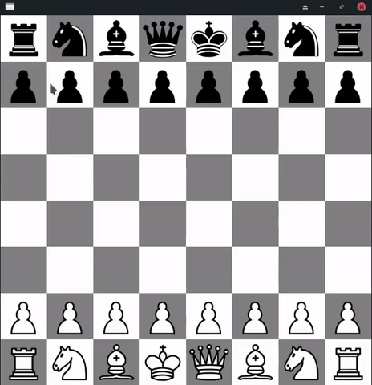

# JFxChess
A ChessGame Built Using JavaFx

### About
It's a simple chess game,GUI part is built using JavaFx and all logics are coded using Java.   
It is working smoothly ,few of rules have to be implemented.Feel Free to make changes and modify  
the source code.

### Working with the project
This project can be directly imported in IntelliJ and developers can start straightaway.

### Running the application
Download the Jar File and run.

### A Gif Demo

### To-Do
 - add timers for players
 - make player information gui
 - add icons
 - add checkmate rule
 - add pawn pormotion rule
 - add enpassment rule
 - add pawn first step rule(moving 2 squares first time)
 
### Contributors
 - #### Akash Rai  [![alt text][1.1]][1]  [![alt text][2.1]][2] [![alt text][3.1]][3]
 

<!-- icons without padding -->

[1.1]: https://imgur.com/rVTgk59.png (twitter icon without padding)
[2.1]: http://i.imgur.com/9I6NRUm.png (github icon without padding)
[3.1]: https://imgur.com/rkHV8J0.png (linkedin icon without padding)

<!-- links to your social media accounts -->

[1]: http://www.twitter.com/akashrai2020
[2]: http://www.github.com/iakashrai
[3]: http://www.linkedin.com/in/akash-rai-881973188
