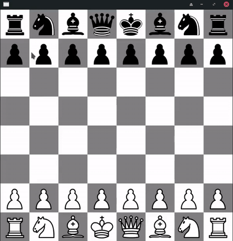

# JFxChess
A Complete, Rules-Compliant Chess Game Built Using JavaFX and Maven.

### About
A fully functional desktop chess application with a JavaFX graphical interface and pure Java logic backend. The application implements standard international chess rules, including advanced mechanics like castling, en passant, pawn promotion, and comprehensive check/checkmate detection algorithms.

### Features
 - **Standard Chess Rules:** Full movement and boundary logic for all pieces.
 - **Advanced Mechanics:** Kingside and Queenside Castling, En Passant, and automatic Pawn Promotion to Queen.
 - **Check & Checkmate Detection:** A robust engine that prevents illegal moves exposing your King to check, and accurately detects Checkmate and Stalemate outcomes.
 - **Custom Player Setup & Management:** Register custom player names, designate White/Black assignments, and view integrated real-time turn tracking during matches.
 - **Save & Resume Game Engine:** Never lose progress! A persistent background autosave system localizes game states instantly, allowing you to hit "Load Game" from the Main Menu to resurrect mid-game sessions.

### Working with the project
This project utilizes **Maven** for effortless module and JavaFX SDK dependency mapping. You can clone the repository and import it natively into IntelliJ IDEA, Eclipse, or any IDE of your choice.

### Running the application
Ensure you have Java JDK 17+ and Maven (mvn) installed. 
From the root directory inside your terminal, run the following command to compile and launch the GUI natively:

```bash
mvn clean compile javafx:run
```

### A Gif Demo


### To-Do
 - add timers for players
 - add network multiplayer (socket programming) support

### Contributors
 - #### Akash Rai  [![alt text][1.1]][1]  [![alt text][2.1]][2] [![alt text][3.1]][3]

[1.1]: https://imgur.com/rVTgk59.png
[2.1]: http://i.imgur.com/9I6NRUm.png
[3.1]: https://imgur.com/rkHV8J0.png

[1]: http://www.twitter.com/akashrai2020
[2]: http://www.github.com/iakashrai
[3]: http://www.linkedin.com/in/akash-rai-881973188
